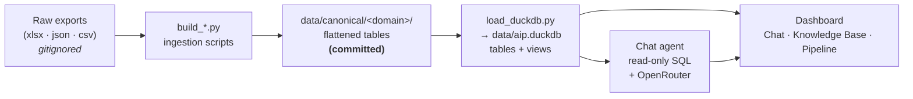

# Academic Intelligence Platform (AIP)

A Streamlit dashboard **and** an AI chat agent over NIAT/NxtWave academic data —
what universities *planned* to teach, what was *actually delivered*, the *content*
behind it, and *student feedback* — unified into one queryable DuckDB store.

Ask any question in plain English ("how did MRV's plan hold up in Semester 1?",
"which courses have the lowest teaching ratings?") and the agent writes SQL against
the live data and answers. Or explore the whole chain visually:

**University → Semester → Subject → Course → Session → Scheduling → Feedback → Instructor.**

> **How the data links:** one map of every layer and the join key on each edge lives in
> [`docs/data-linkage.md`](docs/data-linkage.md) (and in the app's Knowledge Base page).

> **Fork-and-run:** the committed data is enough. You do **not** need the raw source
> exports — the flattened canonical tables are in the repo, and the DuckDB store
> rebuilds from them in one command.

---

## Architecture



The **raw exports** are gitignored (large, regenerable). The **canonical** tables —
grouped by domain — are committed and are all you need. `load_duckdb.py` assembles
them into `data/aip.duckdb`, adding the SQL **views** that pre-solve the tricky joins.
The **dashboard** and **agent** only ever read table/view *names*, so the data can be
reorganised on disk without touching them.

---

## Quickstart

```bash
git clone <this-repo> && cd "Academic Planning - Automation"
pip install -r requirements.txt

# 1. Build the DuckDB store from the committed canonical data (no raw files needed)
python scripts/load_duckdb.py            # → data/aip.duckdb

# 2. Run the tests (validates the store)
python tests/test_db.py

# 3. Launch the dashboard
streamlit run app.py
```

**To use the chat agent**, add an [OpenRouter](https://openrouter.ai) key to
`.streamlit/secrets.toml` (gitignored):

```toml
OPENROUTER_API_KEY = "sk-or-..."
```

### The three pages
- **Chat** — ask anything; the agent runs read-only SQL and explains the answer.
- **Knowledge Base** — the lineage explorer: pick a university + semester and walk
  Subjects → Content, Courses → Sessions, Instructor Delivery, Academic Planning
  (planned vs actual), and an Alignment panel that flags where links break.
- **Pipeline** — the end-to-end flow with live row counts per table/view.

---

## Data, by domain

Canonical tables live under `data/canonical/<domain>/`. Full column-level reference:
**[`docs/data-dictionary.md`](docs/data-dictionary.md)**.

| Domain | What's in it | Key tables |
|---|---|---|
| **delivery/** | What actually ran (Clickup scheduling) | `delivered_niat`, `delivered_sessions`, `sessions` |
| **feedback/** | Student ratings per session | `session_feedback` |
| **instructors/** | Per-instructor delivery stats | `instructor_sessions` |
| **planning/** | Designed plans (HLID/Prod) + standards | `designed_course_plan`, `designed_sequence`, `universities`, `planning_standards`, `scheduling_rules` |
| **content/** | Learning material (readings, quizzes, coding) | `course_content`, `reading_materials`, `objective_questions`, `coding_questions`, `tag_content_map` |
| **subjects/** | Taxonomy / crosswalk (local name ↔ NxtWave subject) | `subject_tags`, `subject_tags_supplement`, `course_crosswalk` |
| **issues/** | RCA / issues log | `issues` |

`data/canonical/subjects/courses.csv` is the 63-course catalogue. `load_duckdb.py` also builds
**views** that join across domains — `session_link`, `academic_plan_derived`,
`course_plan_vs_actual`, `content_all`, `session_feedback_safe`, `college_summary` (see
the data dictionary).

### The join contract (how the layers connect)
- **`unit_id`** is the universal content key (reading / objective / coding / session).
- **`session_id`** links scheduling (`delivered_sessions`) ↔ feedback (`session_feedback`).
- `delivered_niat` (course/instructor) and `delivered_sessions` (scheduling/units) share
  **no key** — the `session_link` view bridges them fuzzily on
  `institute + session_title + start_ts` (~76% at minute precision, ~85% at date). This
  gap is a real finding, surfaced (not hidden) in the Alignment panel.

---

## Data model — the chain (terminology)

Each **layer** and the exact term it maps to. This is the shape the Knowledge Base explorer
walks, and the vocabulary the docs/UI use consistently.

| Layer | Is / column | Notes |
|---|---|---|
| **University** | `institute_name` | scoped by **Semester** |
| **Subject** | `nxtwave_tag` | the canonical NxtWave subject (via `subject_tags`) |
| **Course** | `course_title` (local name) | a Subject can map to **1→many** courses at some universities |
| **Session** | `session_title`, `session_type` = **LECTURE / PRACTICE / EXAM** | the unit of delivery |
| **Instructor** | `instructor_name` | on the delivery export, same row as the Session |
| **Scheduling** | `delivered_sessions` (`session_id`, timestamps) | reached from a Session via the **85% fuzzy bridge**, *not* a shared id |
| **Content unit** | `unit_id` (`resource_type` = **LP_RESOURCE / LP_QUIZ**) | a Session contains **~2** content units (max 14) |
| **Content** | `course_content.kind` = reading / objective / classroom_quiz / coding | the actual material behind a unit |
| **Feedback** | `session_feedback` (by `session_id`) | student ratings on the session |

**Two things worth internalising:**
- **A quiz is a *Content unit*, not a session type.** Sessions are only LECTURE/PRACTICE/EXAM;
  "quiz" lives one level down (`LP_QUIZ` unit / `classroom_quiz` content).
- **The Session→Scheduling hop is a fuzzy bridge, not a join key.** The course+instructor export
  and the schedule+units export share no id; `session_link` reconnects them at ~85%.

---

## Repo layout

```
app.py                 # Streamlit router (3 pages)
aip/                   # shared app code: db, agent, dashboard infra, export
views/                 # the 3 pages: chat, knowledge_base, pipeline
scripts/               # ingestion: build_*.py (raw → canonical) + load_duckdb.py (→ DuckDB)
data/
  canonical/<domain>/  # committed flattened tables, grouped by domain (see table above);
                       #   big domains have sub-folders (content/{catalogue,ingested},
                       #   planning/{designed,standards}); courses.csv is in subjects/
  raw/                 # source exports (mirror the domains) — GITIGNORED, not needed to run
  reports/             # derived one-off reports
docs/
  data-dictionary.md   # per-table reference (start here to query the data)
  data-notes.md        # the agent's data knowledge (recipes, caveats)
  product-context.md   # NIAT/product-family context (delivery modes, batches, IRC) — agent background
  platform-student-experience.md  # how the platform presents courses + data↔UI mapping — agent background
tests/test_db.py       # data + guardrail checks
```

## Adding new data
1. Drop the export under `data/raw/<domain>/`.
2. Run the matching `scripts/build_*.py` (it flattens raw → `data/canonical/<domain>/`).
3. `python scripts/load_duckdb.py` to rebuild the store; `python tests/test_db.py` to verify.
   The new data is immediately queryable by the dashboard and the agent.

## Data scope & caveats
Delivery covers **NIAT Offline** institutes, Semester 1 & 2 (some universities have Sem 3+).
Designed plans (HLID/Prod) exist for 16 of 17 universities. Student **comment text** is
committed in `session_feedback` but excluded from the agent-facing `session_feedback_safe`
view. See `data/README.md` and `docs/data-notes.md` for the full notes.
