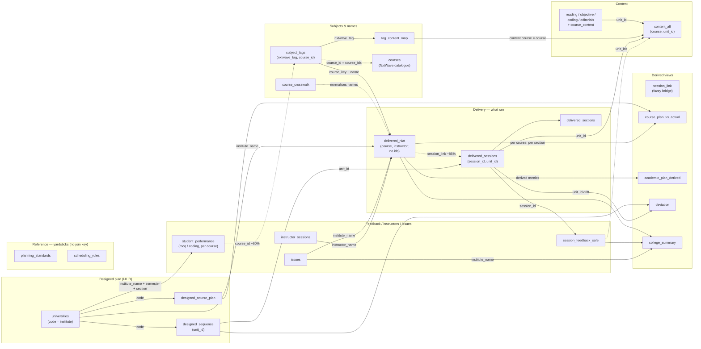

# Data linkage — how every layer connects

One picture of how the whole store links up. For per-table structure see
[`data-dictionary.md`](data-dictionary.md); for query recipes and caveats see
[`data-notes.md`](data-notes.md). This file is the **map**.

## The join keys (everything hangs off these six)

| Key | Connects | Notes |
|---|---|---|
| **`unit_id`** | content ↔ delivery ↔ designed ↔ feedback | **The universal key.** A content unit is the same `unit_id` everywhere. |
| **`session_id`** | scheduling (`delivered_sessions`) ↔ feedback (`session_feedback`) | Stored dash-less (32-hex). Never join on a dashed UUID. |
| **`institute_name`** | delivery ↔ feedback ↔ issues ↔ rollups | The university/college key across almost every table. |
| **`universities.code ↔ institute_name`** | designed layer ↔ delivered layer | HLID uses short codes (MRV, SGU…); delivery uses full names. |
| **`nxtwave_tag`** | subject ↔ content | `subject_tags` (local course → tag) → `tag_content_map` (tag → content course) → `content_all`. |
| **`session_link`** (fuzzy) | `delivered_niat` ↔ `delivered_sessions` | The two delivery tables share **no** id — bridged on institute + session_title + start-minute (~76–85%; ~0% for Sem 3/4). |
| **`institute_name` + `semester` + `section`** | `student_performance` ↔ delivery/feedback | MCQ/coding practice — one row per section×course (22 subjects, 27 course_ids). Aggregate via the rollups and recompute rates. |
| **`course_id`** (partial) | `student_performance` → `subject_tags` / `courses` | NxtWave course UUID (dash-less); resolves to the catalogue subject/content for **~60%** of courses — best-effort, sometimes noisy. |

> **Course names never join reliably across layers.** "Web Development" vs "Web Application Development" vs a
> typo are the same course — normalise with `course_crosswalk` / the `course_key` macros, not raw string match.

## The map

## Two ways to reach content
1. **By subject (name):** `subject_tags.nxtwave_tag` → `tag_content_map` → `content_all.course`.
   Answers *"what content this subject has"* — but only ~13–14 subjects are mapped.
2. **By session (unit):** a delivered session → `session_link` → `unit_id` → `content_all.unit_id`.
   Answers *"which content unit backs this exact session"* — the precise, `unit_id`-grounded path.

## The fuzzy bridge (the one weak link)
`delivered_niat` (course + instructor, no ids) and `delivered_sessions` (session_id + unit_id, but its title is a
session-*type*, not a course) share no key. **`session_link`** reconnects them on institute + session_title +
start-minute (with a same-day fallback), adding `session_id`/`unit_id` and a `linked` flag so the ~15–24% that
don't match stay visible. It is the spine that lets a *course* reach its *units*, *content*, and *feedback* — and
it collapses for Sem 3/4 (which is why those semesters are out of scope).

## Reading the map
- **Solid arrow** = a reliable id/name join (labelled with the key).
- **Dashed arrow** = a fuzzy / best-effort link (`session_link`, feedback-by-unit, name normalisation).
- **Derived views** are computed *from* the tables that point into them (e.g. `college_summary` rolls up
  delivery + feedback + issues per college × semester; `course_plan_vs_actual` compares designed vs delivered).
- **`courses`** (the NxtWave course catalogue) *does* link: `subject_tags.course_id = courses.course_ids` (the
  NxtWave course UUID). It's a partial catalogue (63 rows — ~82 of the 230 tagged subjects resolve to one), so
  the edge is dashed. It tells you the canonical course title, its stack, and whether content exists.
- **Reference yardsticks** — only `planning_standards` and `scheduling_rules` truly have no join key. They're
  plain-text standards (AICTE budgets, session norms) the planner *checks against*, not rows that link.
